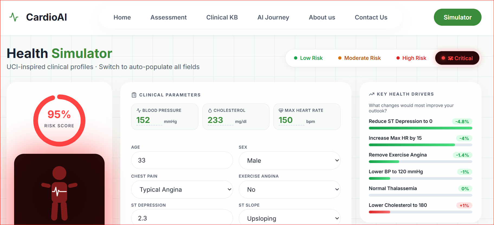

<h1 align="center">❤️ CardioAI: Intelligent Health Analytics System</h1>

<p align="center">
  <em>An advanced clinical decision support system integrating XGBoost, A* Search, and Rule-based Inference to provide explainable cardiac risk stratification.</em>
</p>

<p align="center">
  
  
  
  
</p>

---

## 🌟 Visual Showcase

<p align="center">
  
</p>
<p align="center">
  <em>Counterfactual Risk Simulator</em>
</p>

---

## 📖 Overview

**CardioAI** was built to bridge the gap between raw machine learning probabilities and human-understandable clinical pathways. Instead of just giving a percentage risk, CardioAI explains **why** a patient is at risk, **what** to do about it, and **how** specific lifestyle changes impact their outlook.

It processes 13 clinical features (from the UCI Cleveland Heart Disease dataset) through five distinct AI subsystems:
1. **XGBoost Classifier**: Predicts heart disease probability with high accuracy (~92% AUC).
2. **A* Search Algorithm**: Finds the optimal, minimum-cost clinical pathway to safe patient management.
3. **Forward Chaining Knowledge Base**: Uses 20 medical rules (AHA/ACC sourced) to derive symbolic clinical conclusions.
4. **Counterfactual Simulator**: Probes the ML model in real-time to generate sensitivity analyses.
5. **TF-IDF Search Engine**: Queries an integrated clinical knowledge base for relevant medical literature.

## 📂 Professional Repository Structure

The project has been professionally organized to separate concerns across the backend, frontend, models, and research notebooks.

```text
CardioAI/
├── backend/
│   ├── models/
│   │   ├── heart_disease_model.pkl   # Serialized XGBoost Model
│   │   └── heart_scaler.pkl          # Fitted StandardScaler
│   ├── server.py                     # Flask API Server
│   └── cardioai_gradio.py            # Legacy Python UI
├── frontend/
│   ├── index.html                    # Main Single Page App structure
│   ├── styles.css                    # Professional Dark/Light Theme CSS
│   ├── app.js                        # Main UI Controller & API Client
│   ├── algorithms.js                 # Client-side A*, KB, and NLP algorithms
│   └── model.js                      # Offline JS ML Fallback
├── notebooks/
│   ├── phase_1.ipynb                 # EDA, Preprocessing, and ML Training
│   └── phase_2_(2).ipynb             # AI Architecture (PEAS, Search, KB)
└── docs/
    ├── CARDIOAI_TECHNICAL_DOCUMENTATION.txt
    ├── ASSIGNMENT_REQUIREMENTS_FULFILLMENT.txt
    └── FILE_REFERENCE_GUIDE.txt
```

---

## 🚀 Quick Start Guide

To run CardioAI on your local machine, you need Python 3.10+ installed.

### 1. Clone & Setup
```bash
git clone git@github.com:MAFA-KHAN/CardioAI.git
cd CardioAI
pip install flask flask-cors xgboost scikit-learn pandas numpy
```

### 2. Start the Backend API
```bash
cd backend
python server.py
```
*(The server will start on `http://127.0.0.1:5000`)*

### 3. Launch the Frontend
Simply open `frontend/index.html` in any modern web browser (Chrome, Edge, Safari, Firefox). 
Because it is a Vanilla JS application, no Node.js/NPM build step is required!

---

## 🧠 System Architecture

### 1. Machine Learning Pipeline
Trained on the 303-record UCI Cleveland dataset, the system uses 8 engineered interaction features (e.g., `bp_chol_interaction`, `exercise_stress_score`) to capture complex medical relationships. The XGBoost model incorporates L1/L2 regularization and operates at a deliberately calibrated **0.35 sensitivity threshold** to prioritize catching false negatives.

### 2. Intelligent Search Agent (PEAS)
The system represents the clinical care journey as a state-space graph. Based on the patient's vitals, an **A* Search Algorithm** uses an admissible heuristic to chart the exact clinical interventions required (e.g., *ECG Evaluation → Cardiology Consultation → Risk Stratification*).

### 3. Knowledge Base Inference
A forward-chaining rule engine applies **20 specific medical rules** derived from AHA, ACC, and NHLBI guidelines. It transforms numeric vitals into symbolic facts (e.g., `BP > 140` → `Hypertension`) and derives multi-condition conclusions to ensure safety nets are in place.

### 4. Real-time Simulator
The Simulator tab allows users to select preset patient profiles (Low, Medium, High, Critical) inspired by K-Means cluster centroids. It features a stunning SVG-animated bento-box UI that runs live sensitivity analysis, showing precisely which lifestyle changes (e.g., reducing ST depression) will most effectively lower risk.

---

## 📚 Deep Documentation
For examiners or developers wishing to dive into the technical theory and rubric fulfillment, please review the files in the `docs/` folder:
- `ASSIGNMENT_REQUIREMENTS_FULFILLMENT.txt`: A point-by-point mapping of rubric requirements.
- `CARDIOAI_TECHNICAL_DOCUMENTATION.txt`: Deep explanation of the ML pipeline, A* heuristic, and 20 KB rules.
- `FILE_REFERENCE_GUIDE.txt`: An index of every file's exact purpose.

---

## 🙏 Acknowledgments
CardioAI leverages powerful open-source tools and datasets. Special thanks to:
* **[UCI Machine Learning Repository](https://archive.ics.uci.edu/)**: For providing the foundational Cleveland Heart Disease dataset.


---
<p align="center">
  <em>Made with ❤️ by MAFA. Not for Clinical Use.</em>
</p>
