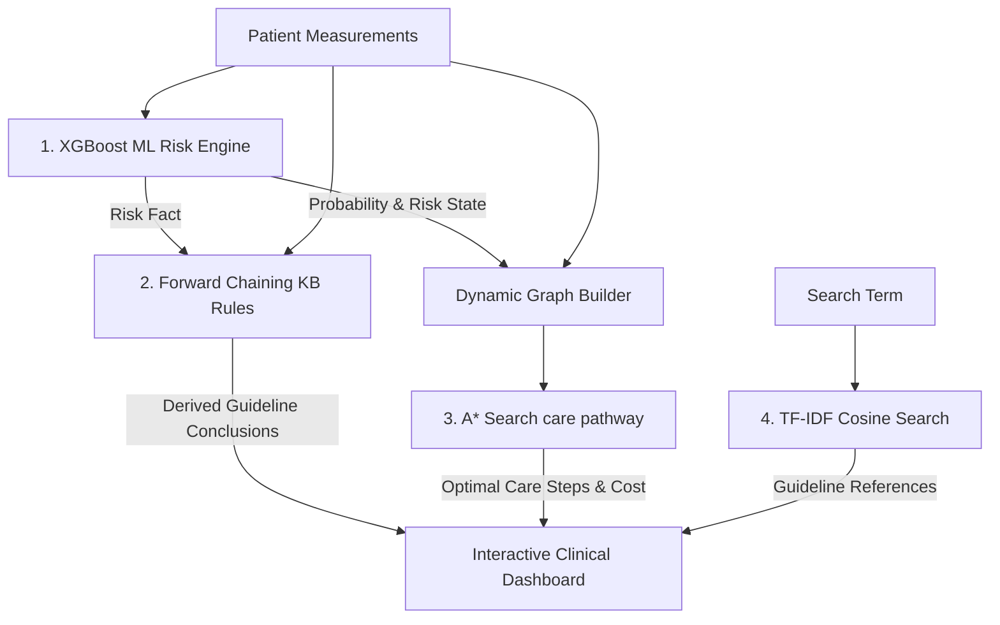

# CardioAI — Phase 2: AI Algorithms & Integration

This document outlines the artificial intelligence planning, reasoning, and information retrieval algorithms developed in Phase 2, detailing how they are structured in the notebook and integrated into both the Python Flask backend and the JavaScript frontend.

---

## 1. Multi-Paradigm AI Architecture
CardioAI integrates four distinct AI paradigms to deliver clinical decision support:

---

## 2. A* Search Agent (Clinical care pathway Planner)
The pathway planner represents treatment routing as a pathfinding problem on a directed graph.

### A. Formal Problem Formulation
* **State Space ($S$)**: Standard clinical states:
  * *Initial States*: `Low Risk`, `Medium Risk`, `High Risk` (determined by the ML classifier).
  * *Intermediate Intervention States*: `Blood Pressure Management`, `Cholesterol Management`, `ECG Evaluation`, `Stress Evaluation`, `Cardiology Consultation`, `Risk Stratification`, `Treatment Planning`.
  * *Goal State ($G$)*: `Goal State` (optimal care plan delivered).
* **Initial State ($s_0$)**: Selected dynamically based on the XGBoost output risk tier.
* **Actions ($A$)**: Administering tests, counseling, or referrals.
* **Transition Model ($T(s, a) \rightarrow s'$)**: Moving from one clinical milestone to the next.
* **Step Cost ($c(s, a, s')$)**: Mapped to clinical resource intensity ($1$ for simple tests, $2$ for diagnostic regimens, $0$ for final planning).

### B. Dynamic Graph Construction
Edges are generated based on the patient's individual risk factors:
* If systolic BP $\ge 140$ mmHg $\rightarrow$ add edge to `Blood Pressure Management` (cost = 2).
* If cholesterol $\ge 240$ mg/dL $\rightarrow$ add edge to `Cholesterol Management` (cost = 2).
* If exercise angina is present $\rightarrow$ add edge to `ECG Evaluation` (cost = 1).
* If ST depression $> 2.0$ mm $\rightarrow$ add edge to `Stress Evaluation` (cost = 1).
* If age $\ge 60$ years $\rightarrow$ add edge to `Cardiology Consultation` (cost = 1).
* *All active intervention states then connect to Cardiology Consultation (cost = 1), leading to Risk Stratification (cost = 1), Treatment Planning (cost = 1), and Goal State (cost = 0).*

### C. Admissible Heuristic ($h(n)$)
The heuristic function $h(n)$ estimates the remaining clinical cost to reach the Goal State:
* $h(\text{Goal State}) = 0$
* $h(\text{Risk Stratification}) = h(\text{Treatment Planning}) = 1$
* $h(\text{Cardiology Consultation}) = 2$
* $h(\text{ECG Evaluation}) = h(\text{Stress Evaluation}) = 3$
* $h(\text{Blood Pressure / Cholesterol Management}) = 4$
* $h(\text{High Risk}) = 5, h(\text{Medium Risk}) = 3, h(\text{Low Risk}) = 1$

> [!IMPORTANT]
> **Proof of Admissibility**: A heuristic is admissible if it never overestimates the actual cost to the goal ($h(n) \le h^*(n)$). Since the minimal cost steps to transition through the clinical pipeline (e.g., Consult $\rightarrow$ Stratification $\rightarrow$ Planning $\rightarrow$ Goal) requires at least the specified step counts, $h(n)$ is admissible. This guarantees that the A* agent finds the mathematical minimum-cost pathway.

---

## 3. Knowledge-Based Expert System (Clinical Inference)
A forward-chaining expert system evaluates patient data against **24 medical rules** to infer secondary findings and reference clinical guidelines.

### Rule Classification
1. **Tier 1 (Single-Feature Risk Flags - R01 to R09)**:
   * Maps individual measurements to clinical categories (e.g., `trestbps >= 140` $\rightarrow$ `hypertension`, grounded in AHA/ACC guidelines).
2. **Tier 2 (Combined Risk Rules - R10 to R14)**:
   * Correlates multiple flags (e.g., `hypertension` + `hyperlipidemia` $\rightarrow$ `elevated_cardiovascular_risk`, modeling metabolic syndrome).
3. **Tier 3 (Clinical Pathway Rules - R15 to R24)**:
   * Maps inferred clinical categories to procedural steps (e.g., `critical_screening_needed` $\rightarrow$ `diagnostic_testing` $\rightarrow$ `cardiology_consultation`).

### Forward-Chaining Engine
The engine initializes a facts database containing patient metrics and the ML risk classification. It iteratively applies rule conditions ($\text{IF } A \subset \text{Facts} \rightarrow \text{THEN add } B$) until a fixed point is reached where no new conclusions can be derived.

---

## 4. NLP Medical Text Search (TF-IDF Cosine Similarity)
To support clinical decision-making with medical literature, the app contains an information retrieval engine:
1. **Document Corpus**: $10$ core documents summarized from professional clinical guidelines (AHA, ACC, Mayo Clinic, CDC).
2. **Vectorizer**: The text is converted into Term Frequency-Inverse Document Frequency (TF-IDF) vectors, isolating term relevance.
3. **Cosine Similarity**: User queries are vectorized and compared against the document database:
   $$\text{Similarity}(q, d) = \frac{q \cdot d}{\|q\| \|d\|}$$
   The document with the highest cosine angle is returned as the most relevant guideline.

---

## 5. Frontend-Backend Architecture Integration

* **Online Mode**:
  * The Python Flask backend (`server.py`) performs the A* Search using a priority queue (`heapq`) and NetworkX.
  * The backend executes forward chaining over the rule database in Python, returning a unified JSON containing predictions, pathway nodes, and rule fire traces.
* **Offline Fallback Mode**:
  * The JavaScript client file `frontend/algorithms.js` replicates the exact same search logic, graph construction, 24 rules, and TF-IDF vectors.
  * The interface runs these calculations locally in the browser, preventing network failures from causing application downtime.
