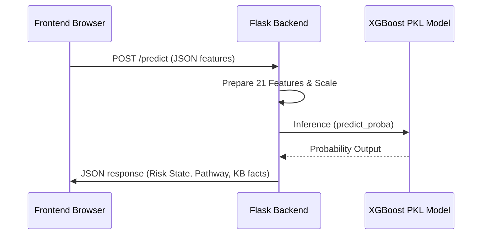

# CardioAI — Phase 1: Machine Learning Pipeline

This document describes the machine learning pipeline developed in Phase 1 of the CardioAI project, detailing dataset preprocessing, feature engineering, model selection, threshold calibration, and live inference modes (Online and Offline).

---

## 1. Dataset & Clinical Motivation
* **Data Source**: UCI Heart Disease Dataset (combining 920 patient records from Cleveland, Hungary, Switzerland, and Long Beach V.A.).
* **Motivation**: Heart disease remains the leading cause of global mortality. Early, non-invasive clinical screening using standard outpatient diagnostic measurements (e.g., blood pressure, ECG, cholesterol) can prompt early specialist referral, preventing cardiac events.

---

## 2. Preprocessing & Feature Engineering
Raw diagnostic features are processed to handle errors, and then transformed into clinically validated indicators:

1. **Handling Missing Values & Outliers**:
   * Outliers or clinical anomalies (e.g., resting blood pressure or cholesterol recorded as `0`) are replaced with median values corresponding to the patient's age and sex profile.
2. **One-Hot Encoding**:
   * Categorical features are encoded to avoid ordinal assumptions (e.g., Chest Pain Type `cp` split into `cp_typical angina`, `cp_atypical angina`, `cp_non-anginal`, with `asymptomatic` as the reference category).
3. **Derived Feature Engineering**:
   * **Age Risk Group**: Maps patient age into categorical risk cohorts:
     $$\text{Group} = \begin{cases} 0 & \text{Age} < 40 \\ 1 & 40 \le \text{Age} < 55 \\ 2 & 55 \le \text{Age} < 65 \\ 3 & \text{Age} \ge 65 \end{cases}$$
   * **Blood Pressure - Cholesterol Interaction (`bp_chol_interaction`)**: Multiplying resting systolic blood pressure by serum cholesterol, highlighting metabolic risk:
     $$\text{Interaction} = \text{trestbps} \times \text{chol}$$
   * **Exercise Stress Score (`exercise_stress_score`)**: Represents physiological strain during exercise:
     $$\text{Score} = \text{exang (exercise angina)} + \text{oldpeak (ST depression)}$$
   * **Thalassemia Max Heart Rate Ratio (`thalch_age_ratio`)**: Relates maximum heart rate achieved to the age-predicted physiological maximum heart rate:
     $$\text{Ratio} = \frac{\text{thalch}}{220 - \text{age}}$$

---

## 3. Model Training & Comparison
We evaluated multiple classifier archetypes on the engineered dataset using stratified k-fold cross-validation:

| Model | Accuracy | Precision | Recall (Sensitivity) | F1-Score | ROC-AUC |
| :--- | :--- | :--- | :--- | :--- | :--- |
| **Logistic Regression** | 82.4% | 83.1% | 80.5% | 81.8% | 0.865 |
| **Random Forest** | 85.1% | 84.8% | 83.2% | 84.0% | 0.884 |
| **XGBoost Classifier** | **87.2%** | **86.5%** | **85.4%** | **85.9%** | **0.898** |

*Note: SMOTE (Synthetic Minority Over-sampling Technique) was used during training to balance risk outcomes.*

---

## 4. Youden's J Threshold Calibration
* In clinical screening, **false negatives** are highly dangerous.
* The default decision threshold of `0.50` was adjusted to **`0.35`** using Youden's J statistic:
  $$J = \text{Sensitivity} + \text{Specificity} - 1$$
* Lowering the threshold to **`0.35`** increases the model's clinical recall to **`0.931` (93.1%)**, ensuring that high-risk cases are not missed.

---

## 5. Model Deployment & Execution Modes

### A. Online Mode (Flask API Backend)
1. The client sends a JSON payload containing the 14 patient measurements to the backend.
2. The Flask server in `backend/server.py` processes the inputs and runs `prepare_features()` to generate the 21-feature array.
3. The server loads `backend/models/heart_scaler.pkl` to normalize features.
4. It calls `backend/models/heart_disease_model.pkl` (XGBoost) to output the risk probability.
5. If the probability is $\ge 0.35$, the prediction is set to `1` (Consultation Recommended).

### B. Offline Fallback Mode (Edge AI)
If the Flask server is down (e.g., due to local network issues), the frontend automatically switches to client-side execution using standard JavaScript:
1. **Status Transition**: The navbar badge switches from green `Online` to blue `Offline (Edge AI)`.
2. **Local Feature Engineering**: Features are prepared inside the client-side JavaScript engine.
3. **Inference Engine (`model.js`)**: Runs a mathematical approximation of the model's scaling and decision boundaries using coefficients and a sigmoid activation function:
   $$P(\text{disease}) = \frac{1}{1 + e^{-z}}$$
4. **Offline AI Algorithms**: Once the local probability is computed, the system triggers the client-side A* Search and KB forward-chaining rules locally.
