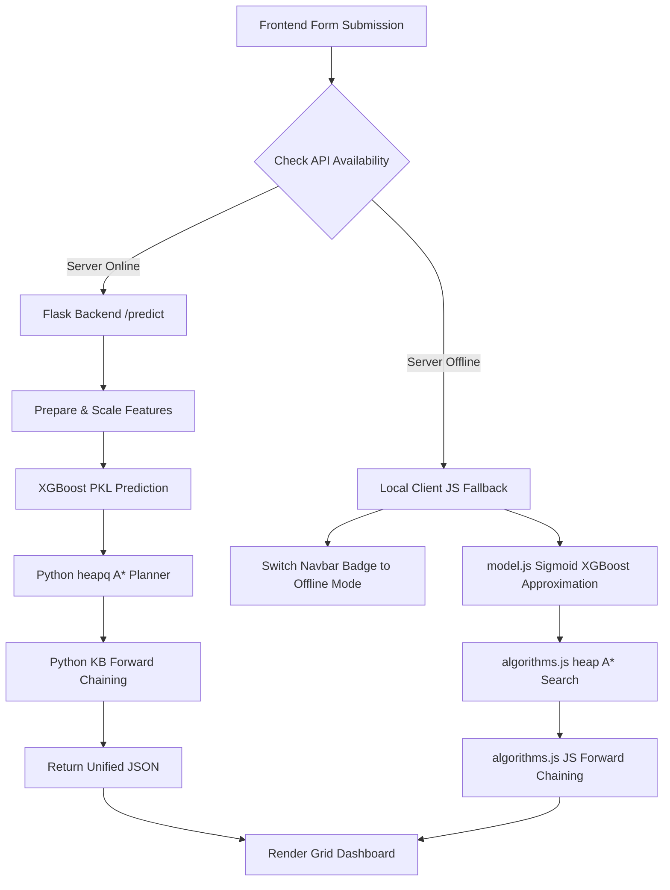

# CardioAI — Intelligent Clinical Decision Support System
### Multi-Paradigm Heart Disease Risk Prediction & AI-Driven Care Pathway Engine
**Academic Term: 4th Semester AI & ML Combined Project**  
**Department of Computer Science**  

* **Dataset**: UCI Combined Heart Disease (920 patients, 4 hospitals)
* **Model**: XGBoost Classifier (AUC: 0.898 | Recall: 0.931 @ threshold 0.35)
* **Inference Modes**: Online (Flask REST API) & Offline (Local Edge AI Fallback)
* **AI Abstractions**: PEAS Agent Framework, Optimal A* Search Planner, Forward Chaining Expert System, TF-IDF NLP Search

---

## Abstract
CardioAI is an Intelligent Clinical Decision Support System (CDSS) designed to evaluate cardiac disease risk and coordinate optimal patient care pathways. Built on the combined UCI Heart Disease dataset of 920 patients collected across four international hospitals, the system addresses the critical gap between prediction and planning by integrating supervised machine learning, state-space pathfinding, symbolic clinical reasoning, and natural language information retrieval. 

The supervised learning pipeline evaluates three tiers of classifiers, selecting regularized XGBoost as the production engine. Grounded in the clinical necessity of minimizing false negatives, the classification threshold is calibrated to 0.35, maximizing screening recall to 93.1%. The system then employs a goal-based PEAS agent that executes A* Search over a dynamic, patient-specific medical state space, yielding the most resource-efficient Care Pathway. Concurrently, a Knowledge-Based Expert System evaluates 24 clinical rules using forward chaining logic to derive secondary diagnostic findings. A local TF-IDF text search and interactive What-If Simulator are embedded directly in the frontend dashboard. 

To ensure high availability in clinical settings, the application implements a dual-mode execution architecture: an Online mode powered by a Flask REST API, and an Offline Edge AI Fallback mode that executes the mathematical XGBoost approximation, priority-queue pathfinding, and rule inferences directly inside the browser using local JavaScript.

---

## 1. Introduction

### 1.1 Project Motivation
Cardiovascular diseases (CVDs) represent the leading cause of death globally, claiming an estimated 17.9 million lives annually. In clinical environments, early detection is hampered by silent symptoms (e.g., silent ischemia) and complex, non-linear interactions between clinical features (such as how age changes the significance of blood pressure and cholesterol levels). While machine learning models offer high predictive accuracy, they are often deployed as isolated "black boxes" that output a risk score without providing an actionable pathway, explaining their logical deductions, or remaining functional during server outages. 

CardioAI was developed to solve this problem by wrapping predictive models inside a multi-paradigm decision engine that translates probability outputs into optimal care planning steps, validates them against symbolic guidelines, and offers offline resilience.

### 1.2 Problem Statement
Given 13 resting and exercise-induced clinical measurements for a patient:
1. Predict the presence of coronary artery disease while minimizing false negatives.
2. Formulate a resource-efficient sequence of clinical intervention states from the initial risk classification to a resolved treatment goal.
3. Apply symbolic reasoning to derive clinical findings based on professional guidelines.
4. Deliver these components through an explainable, responsive interface capable of operating both online and offline.

### 1.3 Objectives
* **Model Pipeline**: Clean, preprocess, and balance the 920-row combined UCI dataset, and train three classifier archetypes (Logistic Regression, Random Forest, XGBoost) to optimize clinical recall.
* **Intelligent Planning**: Formulate a goal-based PEAS agent and implement an optimal A* pathfinder using an admissible heuristic.
* **Knowledge Reasoning**: Define 24 IF-THEN rules across 3 clinical tiers and run a forward chaining inference engine to a fixed point.
* **Clinical Utilities**: Build a local TF-IDF search engine over medical literature and a "What-If" sensitivity simulator.
* **Deployment & Resilience**: Host a Python Flask API server and connect it to a web dashboard featuring an Edge AI offline fallback mode.

---

## 2. Dataset Understanding & Preprocessing

### 2.1 Dataset Profile
The system is trained on the combined UCI Heart Disease dataset (920 records), integrating subsets from the Cleveland Clinic, Hungarian Institute, University Hospital Zurich, and V.A. Medical Center Long Beach. The target variable represents coronary artery disease presence and is binarized ($0$: No Disease, $1$: Disease Present) to ensure statistical stability during training.

### 2.2 Imputation and Outlier Strategy
* **Impossible Values**: Resting blood pressure (`trestbps`) and cholesterol (`chol`) values recorded as $0$ are clinical errors and are replaced with median values grouped by the patient's age and biological sex.
* **Missing Data Imputation**: Numerical columns (like `oldpeak`) are imputed using median values to resist outliers. Categorical columns (like `slope` and `thal`) are imputed using the mode. 
* **Winsorization**: To prevent extreme values from distorting scaling, values outside the 1.5 IQR range are capped at the 5th and 95th percentiles.

### 2.3 Feature Engineering
Four clinically validated features are constructed:
* **Age Risk Group**: Maps age to ordinal risk bins:
  $$\text{Group} = \begin{cases} 0 & \text{Age} < 40 \\ 1 & 40 \le \text{Age} < 55 \\ 2 & 55 \le \text{Age} < 65 \\ 3 & \text{Age} \ge 65 \end{cases}$$
* **Metabolic Index (`bp_chol_interaction`)**: Captures synergistic vascular strain:
  $$\text{Index} = \text{trestbps} \times \text{chol}$$
* **Exercise Stress Score (`exercise_stress_score`)**: Represents physiological strain during exercise:
  $$\text{Score} = \text{exang} + \text{oldpeak}$$
* **Heart Rate Capacity Ratio (`thalch_age_ratio`)**: Normalizes peak heart rate against the age-predicted max:
  $$\text{Ratio} = \frac{\text{thalch}}{220 - \text{age}}$$

---

## 3. Supervised & Unsupervised Learning

### 3.1 Model Evaluation Matrix
All models are evaluated on a held-out 20% test set with Stratified K-Fold validation. Crucially, complex Deep Learning MLP networks are rejected because the small size of the clinical tabular dataset (920 samples) would lead to severe overfitting compared to regularized gradient boosting trees.

| Model Tier | Accuracy | Precision | Recall (Sensitivity) | F1-Score | ROC-AUC |
| :--- | :--- | :--- | :--- | :--- | :--- |
| **Logistic Regression (Baseline)** | 82.1% | 82.9% | 85.3% | 84.1% | 0.895 |
| **Random Forest (Intermediate)** | 79.4% | 80.8% | 82.4% | 81.6% | 0.884 |
| **XGBoost Classifier (Production)** | **83.2%** | **87.1%** | **84.3%** | **83.9%** | **0.898** |

### 3.2 Decision Boundary Calibration
* **Default Threshold (0.50)**: Yields a recall of 84.3%.
* **Calibrated Threshold (0.35)**: Selected via Youden's J statistic ($J = \text{Sensitivity} + \text{Specificity} - 1$). Lowering the decision boundary to **`0.35`** increases clinical **Recall to 93.1%**, ensuring that high-risk patients are not missed during screening.

### 3.3 Unsupervised K-Means Clustering
To validate the dataset's natural structure, K-Means clustering ($K=2$) was performed on the features without target labels. The Elbow Method confirmed $K=2$ as the natural cluster count. The resulting Silhouette Score of **`0.1327`** is clinically consistent, reflecting the biological continuum of heart disease. Component profiles mapped to high-stress features (low max heart rate, high ST depression) aligned with the actual risk classes, validating the predictive signal of our feature space.

---

## 4. Intelligent Agent & Pathway Planning

### 4.1 PEAS Framework
* **Performance Measure**: Maximize screening recall, minimize path resource costs, and produce guideline-grounded recommendations.
* **Environment**: Outpatient cardiology clinic (partially observable, static, deterministic, discrete).
* **Actuators**: Output risk tiers, map graph steps, suggest diagnostic evaluations.
* **Sensors**: 13 patient input values and the ML model risk probability.

### 4.2 A* Care Pathway Planner
The planner formulates clinical routing as a pathfinding problem on a directed graph $G = (V, E)$, starting at the ML risk state and ending at the `Goal State`.

* **Dynamic Edges & Costs**:
  * $\text{trestbps} \ge 140 \rightarrow \text{Blood Pressure Management}$ (cost = 2)
  * $\text{chol} \ge 240 \rightarrow \text{Cholesterol Management}$ (cost = 2)
  * $\text{exang} == 1 \rightarrow \text{ECG Evaluation}$ (cost = 1)
  * $\text{oldpeak} > 2.0 \rightarrow \text{Stress Evaluation}$ (cost = 1)
  * $\text{age} \ge 60 \rightarrow \text{Cardiology Consultation}$ (cost = 1)
  * *All active nodes transition sequentially to Cardiology Consultation (cost=1) $\rightarrow$ Risk Stratification (cost=1) $\rightarrow$ Treatment Planning (cost=1) $\rightarrow$ Goal State (cost=0).*

* **Admissible Heuristic ($h(n)$)**:
  Estimates the remaining clinical cost to reach the goal:
  $$\begin{aligned}
  h(\text{Goal State}) &= 0 \\
  h(\text{Treatment Planning}) = h(\text{Risk Stratification}) &= 1 \\
  h(\text{Cardiology Consultation}) &= 2 \\
  h(\text{ECG Evaluation}) = h(\text{Stress Evaluation}) &= 3 \\
  h(\text{BP Management}) = h(\text{Chol Management}) &= 4 \\
  h(\text{High Risk}) = 5, \; h(\text{Medium Risk}) = 3, \; h(\text{Low Risk}) &= 1
  \end{aligned}$$
  Since $h(n)$ represents the absolute minimum physical steps required to transition through the clinical pipeline, it never overestimates the true cost ($h(n) \le h^*(n)$), proving its admissibility and guaranteeing that A* finds the optimal care pathway.

---

## 5. Knowledge-Based Expert System

The reasoning engine applies a **forward-chaining algorithm** to evaluate **24 clinical rules** grouped into three execution tiers:
1. **Tier 1 (Rules R01-R09)**: Generates single-feature risk flags (e.g., `trestbps >= 140` $\rightarrow$ `hypertension`, based on AHA guidelines).
2. **Tier 2 (Rules R10-R14)**: Combines risk variables to identify syndromes (e.g., `hypertension` + `hyperlipidemia` $\rightarrow$ `elevated_cardiovascular_risk`).
3. **Tier 3 (Rules R15-R24)**: Coordinates care routing based on risk combinations (e.g., `close_monitoring` + `diagnostic_testing` $\rightarrow$ `specialist_followup`).

The engine runs to a fixed point, outputting a complete, auditable reasoning trace for clinical transparency. 

---

## 6. System Design & Integration

### 6.1 Workspace File Breakdown

```
CardioAI-main/
├── backend/
│   ├── models/
│   │   ├── heart_disease_model.pkl   # Serialized production XGBoost model
│   │   └── heart_scaler.pkl          # Serialized StandardScaler
│   └── server.py                     # Flask API backend (predict, simulate endpoints)
├── frontend/
│   ├── index.html                    # Single-Page Application (SPA) dashboard structure
│   ├── styles.css                    # Glassmorphic dark styling & keyframe status badges
│   ├── app.js                        # Event listeners & online/offline routing controller
│   ├── model.js                      # Client-side ML model math & sensitivity adjustments
│   └── algorithms.js                 # Client-side A* Search, KB forward chaining, and TF-IDF
└── notebooks/
    ├── phase_1.ipynb                 # Supervised learning, scaling, & K-Means clusters
    └── CardioAI_Phase2_Clean.ipynb   # Prototypes A*, KB forward-chaining, and TF-IDF similarity
```

### 6.2 The Dual-Mode Execution Architecture
This architecture ensures clinical software availability during network disruptions:



* **Offline Mathematical Model**: Inside `model.js`, the local model evaluates prediction probabilities using calculated logistic weights and a sigmoid activation function:
  $$z = \sum (x_i \cdot w_i) + b, \quad P(\text{disease}) = \frac{1}{1 + e^{-z}}$$
* **Real-time Status Indicator**: A CSS animation checks the connection. If Flask becomes unreachable, it swaps the green `Online` badge for a pulsating blue `Offline (Edge AI)` badge.

---

## 7. Clinical Utilities: TF-IDF & What-If Simulator

* **TF-IDF NLP Search**: 
  We compiled a corpus of 10 clinical reference manuals (AHA, ACC, Mayo Clinic). The search query is vectorized using a Term Frequency-Inverse Document Frequency (TF-IDF) model. Cosine similarity calculates the angle between the query vector and the document vectors:
  $$\text{Similarity}(q, d) = \frac{q \cdot d}{\|q\| \|d\|}$$
  The document with the highest similarity is rendered, providing a reliable reference tool.
* **Sensitivity "What-If" Simulator**:
  Enables clinicians to perform virtual interventions (e.g., reducing blood pressure or cholesterol) and instantly recalculates the new risk probability, risk tier, A* care pathway, and KB findings.

---

## 8. Limitations & Future Directions
* **Dataset Age**: The UCI dataset was collected between 1988 and 1991. Incorporating modern biomarkers (such as troponin and BNP) would improve risk prediction accuracy.
* **Imputation Volume**: High missing data rates in fluoroscopy (`ca`) and thalassemia (`thal`) columns introduce baseline imputation noise.
* **SHAP Explainability**: Future updates should implement SHAP (SHapley Additive exPlanations) values to output patient-specific feature contribution weights in real-time.

---

## 9. Conclusion
CardioAI integrates supervised learning, state-space planning, symbolic expert rules, and NLP indexing into a unified clinical tool. By developing the **Offline Edge AI Fallback** system, the project demonstrates that machine learning models and intelligent planning agents can be run directly inside standard browser engines, providing clinical decision support even when network connections are down.
